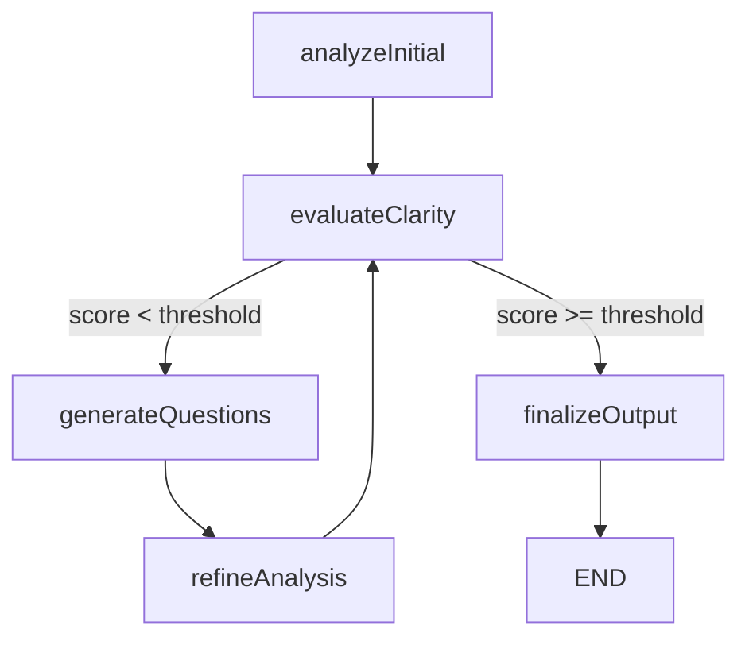

# Agent Self-Refinement Workflow with LangGraph

## Overview

All agents now use LangGraph StateGraph workflows for internal self-refinement through iterative questioning. This implements an **agentic pattern** where agents continuously evaluate and improve their own outputs.

## Architecture

### Base Agent Workflow

All agents extend `BaseAgentWorkflow` which provides:

1. **StateGraph-based workflow** with conditional routing
2. **Self-evaluation** of analysis quality
3. **Self-questioning** to identify gaps
4. **Iterative refinement** until quality threshold met
5. **Automatic LangSmith tracing** for observability

### Workflow Nodes



### State Management

```typescript
const AgentWorkflowState = Annotation.Root({
  context: Annotation<AgentContext>(),
  iteration: Annotation<number>(),
  currentAnalysis: Annotation<string>(),
  missingInformation: Annotation<string[]>(),
  clarityScore: Annotation<number>(),
  selfQuestions: Annotation<string[]>(),
  finalAnalysis: Annotation<string>(),
  refinementNotes: Annotation<string[]>(),
});
```

## Workflow Steps

### 1. Initial Analysis

- Agent performs first-pass analysis
- Uses agent-specific system and human prompts
- Generates initial output

### 2. Evaluate Clarity

Agent self-evaluates on 4 criteria (0-100 scale):
- **Completeness**: Coverage of all aspects
- **Clarity**: Structure and readability
- **Depth**: Level of detail
- **Accuracy**: Information correctness

Overall score = average of all criteria

### 3. Generate Questions

If score < threshold:
- Agent identifies gaps in analysis
- Generates 3-5 specific questions to address gaps
- Questions are concrete and actionable

Example questions:
```
1. What are the specific naming conventions used in the src/services directory?
2. How are test files organized relative to source files?
3. What configuration management patterns are evident in the config/ structure?
```

### 4. Refine Analysis

- Agent answers its own questions
- Incorporates new insights into analysis
- Produces improved version

### 5. Iterate or Finalize

**Conditions to finalize:**
- Clarity score >= threshold (default: 80)
- Max iterations reached (default: 3)

**Otherwise**: Return to step 2 for another evaluation cycle

## Configuration

```typescript
const config: AgentWorkflowConfig = {
  maxIterations: 3,              // Maximum refinement cycles
  clarityThreshold: 80,          // Minimum score to accept (0-100)
  minImprovement: 5,             // Minimum improvement per iteration
  enableSelfQuestioning: true,   // Enable question generation
};
```

## Implementation Example

```typescript
export class FileStructureAgentWorkflow extends BaseAgentWorkflow {
  protected getAgentName(): string {
    return 'file-structure';
  }
  
  protected async buildSystemPrompt(context: AgentContext): Promise<string> {
    return `You are an expert at analyzing project file structures...`;
  }
  
  protected async buildHumanPrompt(context: AgentContext): Promise<string> {
    const fileTree = this.buildFileTree(context.files);
    return `Analyze this file structure:\n${fileTree}`;
  }
  
  protected async parseAnalysis(analysis: string): Promise<Record<string, unknown>> {
    // Parse LLM output into structured data
    return { /* ... */ };
  }
  
  protected async formatMarkdown(data: Record<string, unknown>): Promise<string> {
    // Format as markdown documentation
    return `# File Structure\n\n...`;
  }
  
  protected generateSummary(data: Record<string, unknown>): string {
    return `Analyzed ${data.fileCount} files in ${data.directoryCount} directories`;
  }
}
```

## Benefits

### 1. Self-Improvement
- Agents iteratively refine their own outputs
- No need for external review loops
- Continuous quality improvement

### 2. Completeness
- Agents identify their own blind spots
- Questions guide deeper analysis
- Missing information explicitly tracked

### 3. Observability
- Each iteration traced in LangSmith
- Questions logged for debugging
- Refinement notes explain improvements

### 4. Consistency
- All agents follow same workflow pattern
- Unified quality evaluation criteria
- Predictable refinement behavior

## Trace Hierarchy in LangSmith

```
DocumentationGeneration-Complete
├── ScanProjectStructure
├── CreateExecutionContext
├── ExecuteAgents
│   ├── Agent-file-structure
│   │   ├── file-structure-InitialAnalysis
│   │   ├── file-structure-EvaluateClarity
│   │   ├── file-structure-GenerateQuestions
│   │   ├── file-structure-Refinement-1
│   │   ├── file-structure-EvaluateClarity
│   │   └── file-structure-Finalize
│   ├── Agent-dependency-analyzer
│   │   └── [similar structure]
│   └── ...
└── AggregateResults
```

## Metadata in Agent Results

Each agent result now includes:

```typescript
{
  agentName: 'file-structure',
  status: 'success',
  data: { /* parsed analysis */ },
  summary: '...',
  markdown: '...',
  confidence: 0.85,  // Final clarity score / 100
  warnings: [
    'Iteration 1: Addressed 4 questions',
    'Iteration 2: Addressed 3 questions'
  ],
  metadata: {
    iterations: 2,
    selfQuestions: [
      'What are the naming conventions?',
      'How are tests organized?',
      ...
    ],
    missingInformation: [
      'Configuration patterns unclear',
      ...
    ]
  }
}
```

## Performance Considerations

### Token Usage
- Each iteration adds 1 LLM call for evaluation
- Plus 1 call for question generation
- Plus 1 call for refinement
- **Total**: ~3 calls per iteration
- **Typical**: 2-3 iterations = 6-9 calls per agent

### Time Impact
- Initial analysis: ~10-20s
- Each iteration: ~5-10s
- **Total increase**: ~10-30s per agent
- **Worth it**: Significantly higher quality output

### Cost Optimization
- Set lower `clarityThreshold` for faster execution
- Reduce `maxIterations` for budget constraints
- Disable with `enableSelfQuestioning: false` if needed

## Migration Path

### Current Agents (Direct LLM invocation)
```typescript
const result = await model.invoke([systemPrompt, humanPrompt]);
const analysis = this.parseResult(result);
return this.formatOutput(analysis);
```

### New Agents (Workflow-based)
```typescript
const workflow = new FileStructureAgentWorkflow();
const result = await workflow.execute(context, config, runnableConfig);
// Result includes refined analysis, questions, iterations, metadata
```

## Best Practices

1. **Set appropriate thresholds**: 80 works well for most cases
2. **Limit iterations**: 3 is usually sufficient
3. **Write specific prompts**: Help agent know what "complete" means
4. **Monitor traces**: Use LangSmith to debug refinement loops
5. **Track token usage**: Monitor costs in production

## Future Enhancements

1. **Parallel question answering**: Use `Send` API for faster refinement
2. **Tool calling**: Let agents fetch additional context (files, APIs)
3. **Human-in-the-loop**: Approve expensive iterations
4. **Learned thresholds**: Adjust based on historical quality
5. **Cross-agent learning**: Share questions between similar agents

## Conclusion

This self-refinement workflow transforms agents from simple LLM wrappers into **autonomous, self-improving analysis systems**. By continuously questioning and refining their own outputs, agents produce significantly higher quality documentation with minimal external intervention.

The StateGraph architecture provides:
- ✅ Declarative workflow definition
- ✅ Automatic state management
- ✅ Built-in observability
- ✅ Flexible configuration
- ✅ Scalable refinement patterns

This is a **true agentic pattern** that mirrors how human experts iteratively improve their work through self-reflection and questioning.
