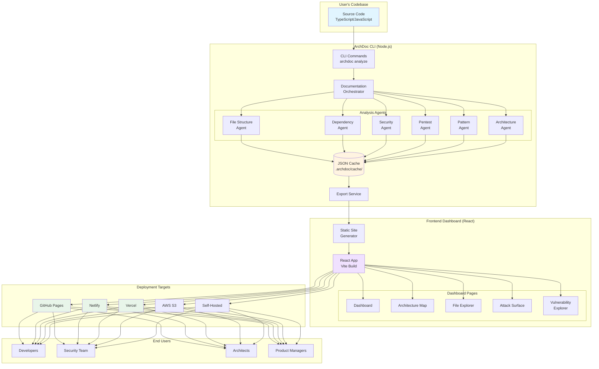
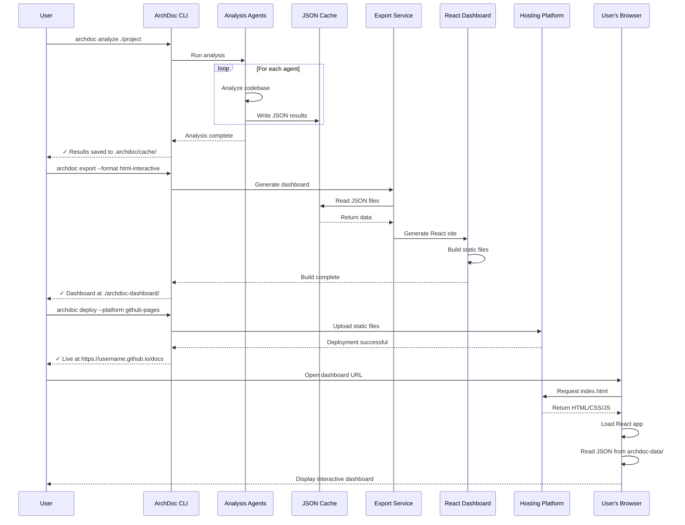
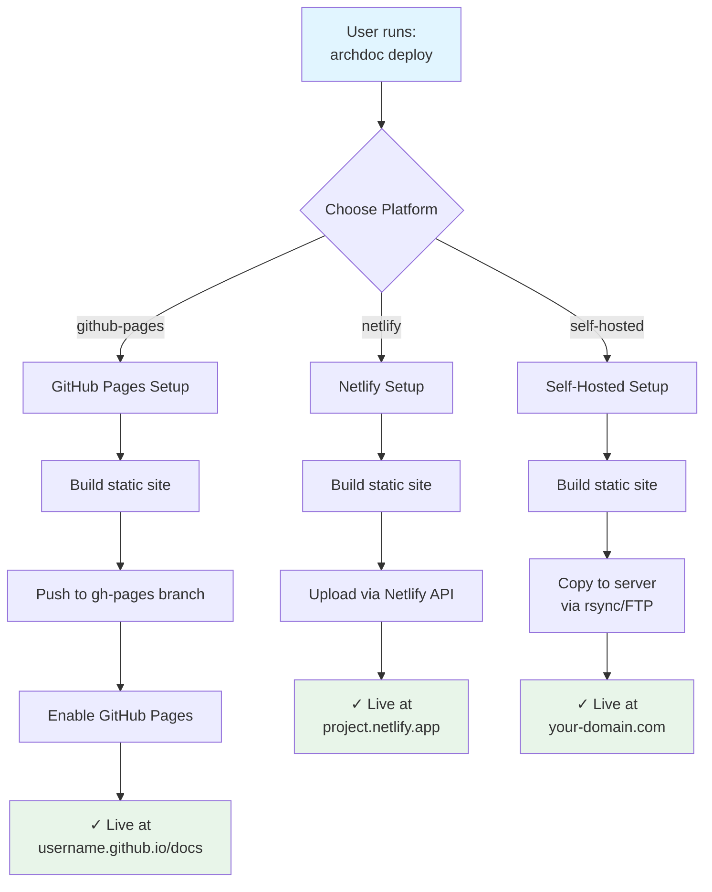
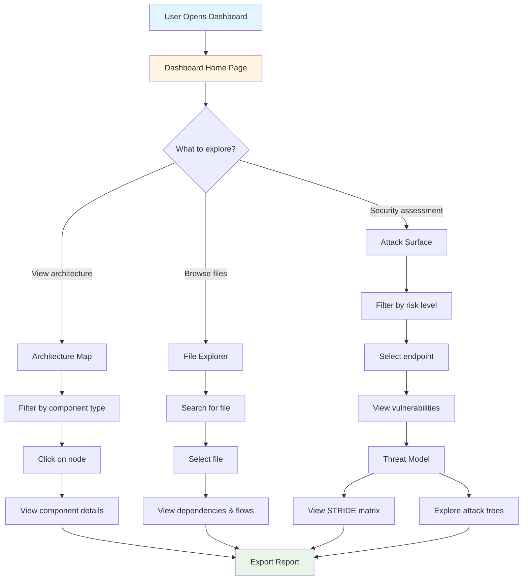
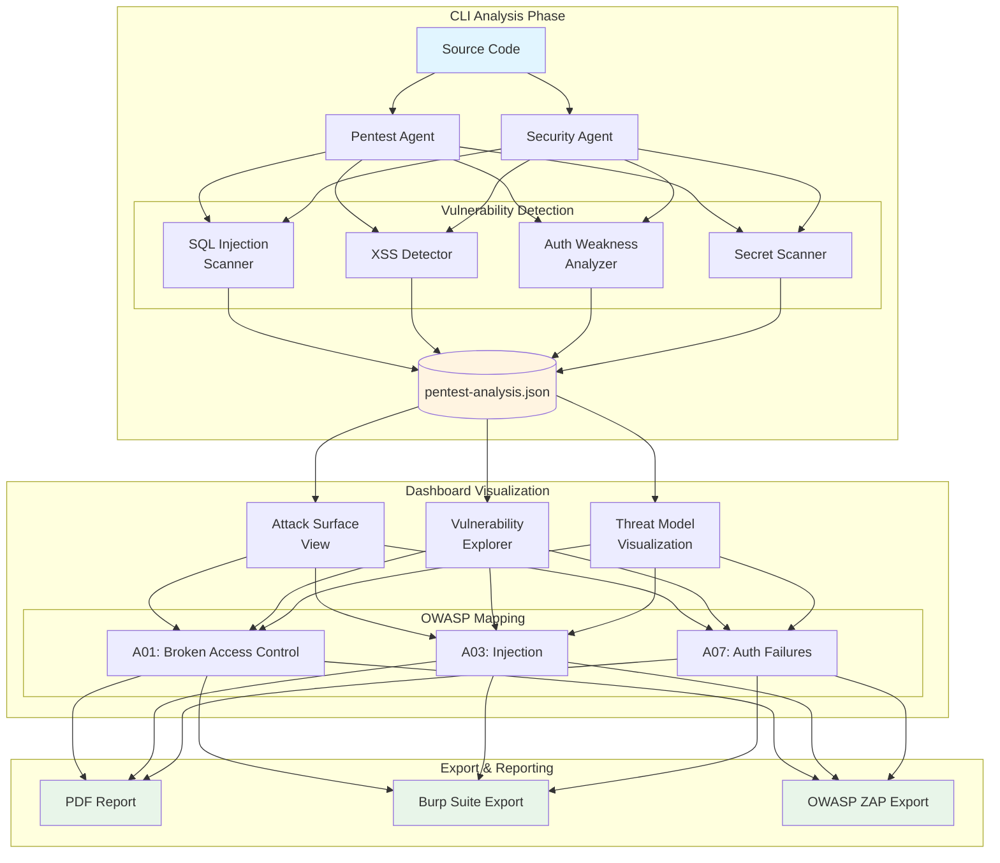
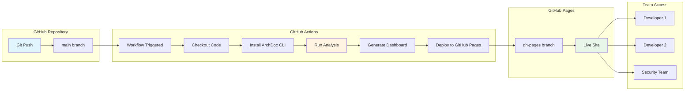
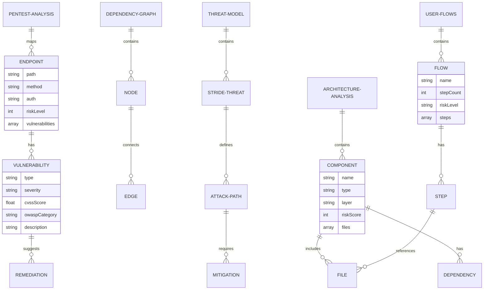
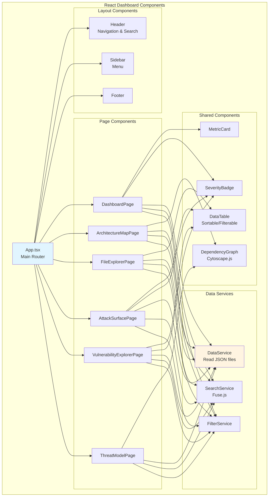
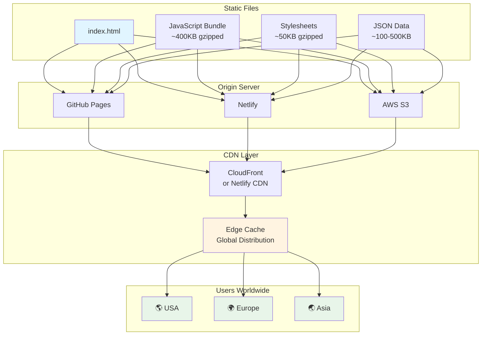
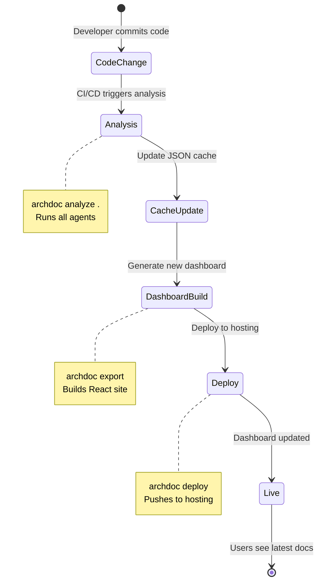

# ArchDoc Architecture Schemas

Visual diagrams showing how ArchDoc CLI, frontend dashboard, and deployment work together.

---

## 📊 System Architecture Overview



---

## 🔄 Data Flow Diagram



---

## 📁 File Structure Schema

```mermaid
graph LR
    subgraph "Project Root"
        SRC[src/]
        ARCHDOC[.archdoc/]
        DASHBOARD[archdoc-dashboard/]
    end

    subgraph ".archdoc/ (Generated by CLI)"
        CONFIG[config.json]
        CACHE_DIR[cache/]

        subgraph "cache/"
            J1[architecture-analysis.json]
            J2[dependency-graph.json]
            J3[security-analysis.json]
            J4[pentest-analysis.json]
            J5[user-flows.json]
            J6[metrics.json]
        end
    end

    subgraph "archdoc-dashboard/ (Static Site)"
        INDEX[index.html]
        ASSETS[assets/]
        DATA[archdoc-data/]

        subgraph "assets/"
            JS[index-[hash].js]
            CSS[index-[hash].css]
        end

        subgraph "archdoc-data/"
            D1[architecture-analysis.json]
            D2[dependency-graph.json]
            D3[pentest-analysis.json]
        end
    end

    SRC -.->|analyzed by| ARCHDOC
    CACHE_DIR -->|copied to| DATA

    style SRC fill:#e1f5ff
    style ARCHDOC fill:#fff4e1
    style DASHBOARD fill:#f0e1ff
```

---

## 🚀 Deployment Flow Schema



---

## 👥 User Interaction Flow



---

## 🔐 Security Analysis Flow



---

## 🔄 CI/CD Integration Schema



---

## 📊 Data Schema: JSON Structure



---

## 🎨 Component Architecture



---

## 🌐 Deployment Architecture



---

## 📈 Update Workflow



---

## 🎯 Summary

These schemas show:

1. **System Architecture**: How CLI, agents, cache, and dashboard connect
2. **Data Flow**: Step-by-step process from analysis to deployment
3. **File Structure**: Where files are stored and how they're organized
4. **Deployment**: Multiple hosting options and workflows
5. **User Interaction**: How users navigate the dashboard
6. **Security Analysis**: How pentest features work
7. **CI/CD Integration**: Automated updates via GitHub Actions
8. **Data Schema**: JSON structure relationships
9. **Component Architecture**: React component hierarchy
10. **Deployment Architecture**: CDN and global distribution
11. **Update Workflow**: How docs stay current

All diagrams are in **Mermaid format** and can be rendered in GitHub, VS Code, or any Markdown viewer that supports Mermaid!
