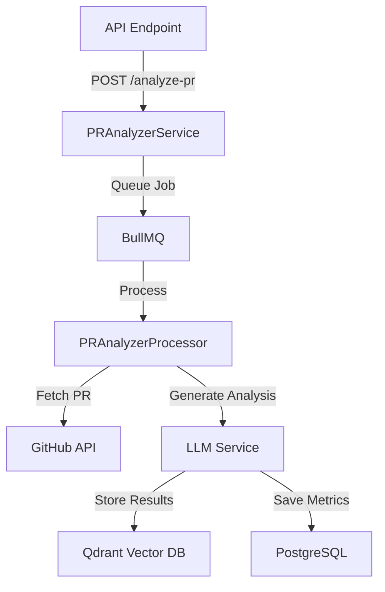
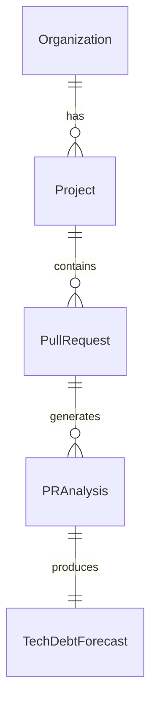
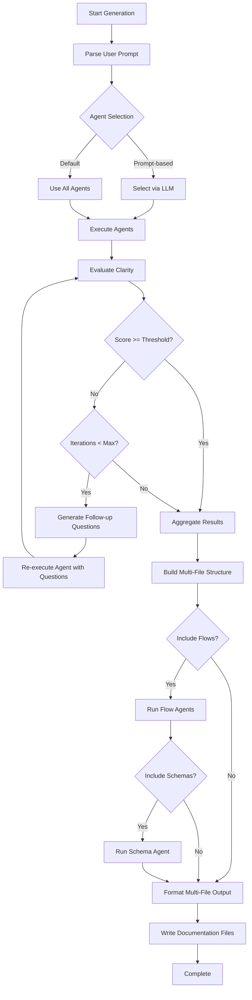

# Enhanced Multi-Agent Orchestrator Design

## Overview

This document describes the enhanced orchestrator architecture that introduces:
1. **Iterative Refinement**: Agents re-run with follow-up questions until clarity threshold is met
2. **Selective Agent Execution**: Natural language prompt-based agent selection
3. **Multi-File Documentation**: Comprehensive folder structure with topic-based markdown files
4. **Flow Visualization**: New agents for data/process flows and schema generation
5. **Clarity Evaluation**: LLM-powered completeness scoring

## Architecture Components

### 1. Enhanced Documentation Orchestrator

```typescript
interface OrchestrationConfig {
  // Existing
  maxTokens: number;
  enableParallel: boolean;
  projectConfig: ProjectConfig;
  
  // New
  iterativeRefinement?: {
    enabled: boolean;
    maxIterations: number;         // Default: 3
    clarityThreshold: number;      // 0-100%, default: 80%
    minImprovement: number;        // Stop if improvement < X%, default: 10%
  };
  
  promptBasedAgentSelection?: {
    enabled: boolean;
    userPrompt?: string;           // e.g., "analyze security and dependencies only"
    fallbackToAll: boolean;        // If parsing fails, run all agents
  };
  
  outputStructure?: {
    multiFile: boolean;            // Generate multiple files vs single file
    includeFlows: boolean;         // Generate flow diagrams
    includeSchemas: boolean;       // Generate schema documentation
  };
}

interface RefinementIteration {
  iterationNumber: number;
  agentName: string;
  clarityScore: number;           // 0-100%
  unclearSections: UnclearSection[];
  followUpQuestions: string[];
  previousResult: AgentResult;
  improvedResult?: AgentResult;
}

interface UnclearSection {
  section: string;
  reason: string;                 // Why it's unclear
  suggestedQuestion: string;      // Follow-up to clarify
  importance: 'critical' | 'high' | 'medium' | 'low';
}
```

### 2. Clarity Evaluation System

```typescript
class ClarityEvaluator {
  /**
   * Evaluate how complete and clear an agent's output is
   */
  async evaluateClarity(
    agentResult: AgentResult,
    context: AgentContext
  ): Promise<ClarityEvaluation> {
    // Use LLM to analyze:
    // - Completeness of analysis
    // - Presence of vague statements ("might be", "unclear", etc.)
    // - Missing expected sections
    // - Incomplete metrics or data
    // - Unanswered implicit questions
    
    return {
      score: 0-100,
      unclearSections: [...],
      followUpQuestions: [...],
      confidence: 0-1
    };
  }
  
  /**
   * Generate targeted follow-up questions
   */
  async generateFollowUpQuestions(
    unclearSections: UnclearSection[],
    agentMetadata: AgentMetadata
  ): Promise<string[]> {
    // Create specific questions to clarify unclear sections
    // Prioritize by importance (critical > high > medium > low)
  }
}
```

**Clarity Evaluation Prompt**:
```
You are evaluating the completeness of an architectural analysis agent's output.

Agent: {agentName}
Agent Purpose: {agentDescription}

Output to Evaluate:
{agentOutput}

Project Context:
{projectContext}

Evaluate the output for:
1. **Completeness** (0-100%): Does it fully cover what the agent should analyze?
2. **Clarity** (0-100%): Are statements specific and unambiguous?
3. **Data Quality** (0-100%): Are metrics, counts, and data points accurate and complete?

Identify unclear sections and generate follow-up questions that would help the agent provide better analysis.

Response format:
{
  "score": 85,
  "unclearSections": [
    {
      "section": "Security Analysis",
      "reason": "Only mentions 'potential vulnerabilities' without specifics",
      "suggestedQuestion": "Which specific packages have known vulnerabilities and what are their CVE IDs?",
      "importance": "critical"
    }
  ],
  "followUpQuestions": [
    "Can you provide specific CVE IDs for vulnerable packages?",
    "What is the severity score for each vulnerability?"
  ],
  "confidence": 0.9
}
```

### 3. Prompt-Based Agent Selection

```typescript
class AgentSelector {
  /**
   * Parse natural language prompt and select relevant agents
   */
  async selectAgentsFromPrompt(
    userPrompt: string,
    availableAgents: Agent[]
  ): Promise<Agent[]> {
    // Use LLM to understand user intent and map to agents
    // Examples:
    // "analyze security" -> [dependency-analyzer, security-scanner]
    // "just show me the file structure" -> [file-structure]
    // "full analysis with flows" -> [all agents + flow agents]
  }
}
```

**Agent Selection Prompt**:
```
You are an agent selection system for architecture documentation.

Available agents:
{agentList with descriptions}

User request: "{userPrompt}"

Select the most relevant agents to fulfill the user's request.
Return agent names as array.

Examples:
- "analyze security and dependencies" -> ["dependency-analyzer", "security-scanner"]
- "show me design patterns" -> ["pattern-detector"]
- "comprehensive analysis" -> ["file-structure", "dependency-analyzer", "pattern-detector", "code-quality", "security-scanner"]
```

### 4. Multi-File Documentation Structure

```
docs/ARCHITECTURE_GENERATED/
├── index.md                    # Navigation hub, executive summary
├── architecture.md             # High-level architecture, components, style
├── file-structure.md           # Directory layout, conventions, organization
├── dependencies.md             # Dependencies analysis, security, recommendations
├── patterns.md                 # Design patterns, architectural patterns, anti-patterns
├── flows.md                    # Data flows, process flows (with Mermaid diagrams)
├── schemas.md                  # Database schemas, API schemas, type definitions
├── code-quality.md             # Quality metrics, complexity, maintainability
├── security.md                 # Security analysis, vulnerabilities, recommendations
├── recommendations.md          # Aggregated recommendations from all agents
├── metadata.json               # Generation metadata, agent execution details
└── assets/
    ├── data-flow-diagram.svg   # Generated flow diagrams
    ├── architecture-diagram.svg
    └── schema-erd.svg
```

**index.md Structure**:
```markdown
# tech-debt-api - Architecture Documentation

Generated: 2025-10-26 | Version: 2.8.0 | Agents: 6

## Executive Summary

{High-level overview synthesized from all agents}

## Documentation Index

### 🏗️ Architecture & Structure
- [Architecture Overview](./architecture.md) - System design, components, patterns
- [File Structure](./file-structure.md) - Directory layout and organization

### 📦 Dependencies & Security
- [Dependencies Analysis](./dependencies.md) - 121 packages analyzed
- [Security Report](./security.md) - Vulnerabilities and recommendations

### 🎨 Patterns & Flows
- [Design Patterns](./patterns.md) - Detected patterns and anti-patterns
- [Flow Visualizations](./flows.md) - Data and process flows

### 📊 Quality & Schemas
- [Code Quality](./code-quality.md) - Metrics and maintainability
- [Schema Documentation](./schemas.md) - Database and API schemas

### 💡 Recommendations
- [Consolidated Recommendations](./recommendations.md) - Prioritized action items

## Quick Stats

| Metric | Value |
|--------|-------|
| Total Files | 1,000 |
| Languages | 9 |
| Dependencies | 121 |
| Security Score | 7/10 |
| Quality Score | 8/10 |
| Patterns Detected | 8 |
| Anti-Patterns | 3 |

## Agent Execution Details

| Agent | Status | Confidence | Iterations |
|-------|--------|------------|------------|
| File Structure | ✅ Success | 92% | 2 |
| Dependency Analyzer | ✅ Success | 88% | 1 |
| Pattern Detector | ✅ Success | 85% | 2 |
| Flow Analyzer | ✅ Success | 80% | 3 |
| Schema Generator | ✅ Success | 90% | 1 |
| Security Scanner | ✅ Success | 87% | 2 |
```

### 5. New Flow Visualization Agents

#### DataFlowAgent

Analyzes data movement through the system:
- API endpoint → Service → Repository → Database flows
- Event/message flows (pub/sub, queues)
- External service integrations
- Data transformation pipelines

**Output**: Mermaid flowcharts showing data paths



#### ProcessFlowAgent

Maps business/technical processes:
- PR analysis workflow
- User authentication flow
- Deployment pipeline
- Error handling flow

#### SchemaGeneratorAgent

Documents schemas:
- Prisma schema → Entity Relationship Diagrams
- API request/response schemas (DTOs)
- TypeScript interfaces and types
- gRPC proto definitions

**Output**: Mermaid ERDs + structured markdown



### 6. Orchestrator Execution Flow



## Implementation Plan

### Phase 1: Core Enhancements (Week 1)
1. ✅ Create design document (this file)
2. Implement `ClarityEvaluator` service
3. Update `DocumentationOrchestrator` for iterative refinement
4. Add refinement iteration tracking in metadata

### Phase 2: Selective Execution (Week 1-2)
1. Implement `AgentSelector` service
2. Add prompt parsing to CLI `generate` command
3. Add `--prompt` flag to CLI
4. Test agent selection with various prompts

### Phase 3: Flow Agents (Week 2)
1. Create `DataFlowAgent` - analyze data movement
2. Create `ProcessFlowAgent` - map business processes
3. Create `SchemaGeneratorAgent` - document schemas
4. Integrate Mermaid diagram generation

### Phase 4: Multi-File Output (Week 2-3)
1. Design file structure and naming conventions
2. Create `MultiFileDocumentationFormatter`
3. Implement topic-based content distribution
4. Generate `index.md` with navigation
5. Add asset management (diagrams, images)

### Phase 5: Testing & Refinement (Week 3)
1. Test on tech-debt-api (1000 files)
2. Test on smaller projects
3. Validate iterative refinement improves quality
4. Performance optimization
5. Documentation updates

## Configuration Examples

### Default (All Agents, Iterative Refinement)
```bash
archdoc generate ./my-project
```

### Selective Agents via Prompt
```bash
archdoc generate ./my-project --prompt "analyze security and dependencies only"
archdoc generate ./my-project --prompt "show me design patterns and code quality"
archdoc generate ./my-project --prompt "full analysis with flows and schemas"
```

### Custom Refinement Settings
```bash
archdoc generate ./my-project \
  --refinement-enabled \
  --refinement-threshold 85 \
  --refinement-max-iterations 5
```

### Multi-File Output
```bash
archdoc generate ./my-project \
  --output ./docs/architecture \
  --multi-file \
  --include-flows \
  --include-schemas
```

### Programmatic API
```typescript
const orchestrator = new DocumentationOrchestrator(registry, scanner);

const result = await orchestrator.generate('./my-project', {
  maxTokens: 200000,
  enableParallel: true,
  
  iterativeRefinement: {
    enabled: true,
    maxIterations: 3,
    clarityThreshold: 80,
    minImprovement: 10
  },
  
  promptBasedAgentSelection: {
    enabled: true,
    userPrompt: 'analyze security and show data flows',
    fallbackToAll: false
  },
  
  outputStructure: {
    multiFile: true,
    includeFlows: true,
    includeSchemas: true
  }
});
```

## Expected Benefits

1. **Higher Quality**: Iterative refinement ensures complete, clear analysis
2. **Flexibility**: Users can request specific analyses via natural language
3. **Comprehensiveness**: Multi-file structure organizes complex information
4. **Visual Understanding**: Flow diagrams and ERDs improve comprehension
5. **Actionable Insights**: Consolidated recommendations prioritize improvements
6. **Scalability**: Handles large projects (1000+ files) with organized output

## Success Metrics

- Clarity scores improve by 15-25% after refinement iterations
- Agent selection accuracy > 90% for common prompts
- Multi-file output reduces cognitive load (easier navigation)
- Flow diagrams generated successfully for 80%+ of projects
- User satisfaction with comprehensive documentation structure

## Future Enhancements

1. **Interactive Refinement**: Allow users to ask follow-up questions via CLI
2. **Diff Mode**: Generate documentation for changes between versions
3. **CI/CD Integration**: Automated documentation updates on PR merge
4. **Custom Templates**: User-defined documentation structure
5. **Export Formats**: PDF, HTML site, Confluence, Notion
6. **Collaborative Editing**: Team annotations and comments
7. **Historical Tracking**: Documentation evolution over time
