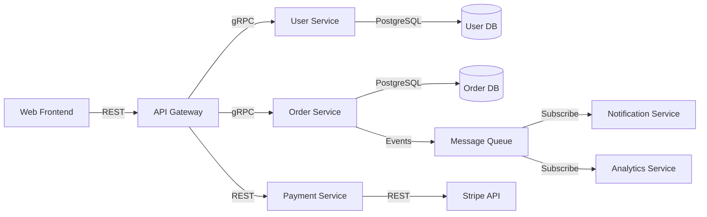
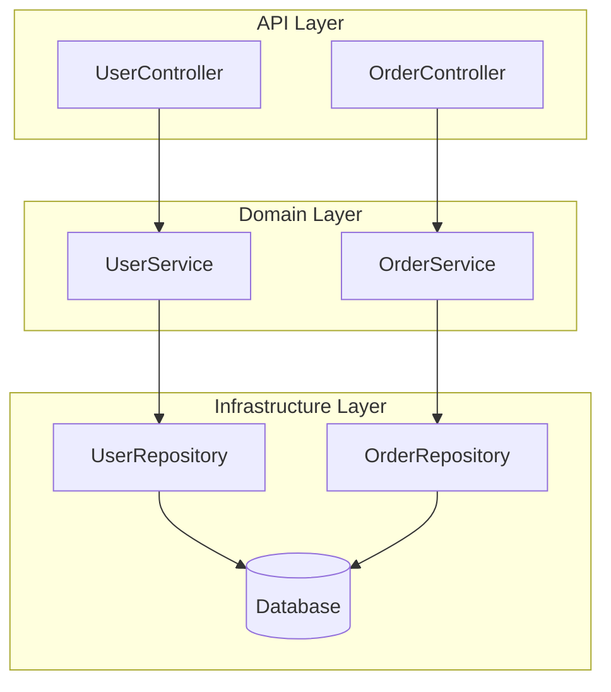

# 🚀 Future Work & Roadmap

This document outlines planned features and enhancements for ArchDoc Generator. Each feature is designed to solve real pain points in software architecture documentation and maintenance.

---

## 📋 Table of Contents

- [Overview](#overview)
- [Priority Framework](#priority-framework)
- [Planned Features](#planned-features)
  - [P0: Critical Features](#p0-critical-features)
  - [P1: High Priority](#p1-high-priority)
  - [P2: Medium Priority](#p2-medium-priority)
  - [Quick Wins](#quick-wins)
- [Roadmap Timeline](#roadmap-timeline)
- [Contributing Ideas](#contributing-ideas)

---

## Overview

ArchDoc Generator currently provides powerful CLI-based architecture documentation generation with AI-powered analysis. Future development focuses on three key areas:

1. **Real-Time Intelligence** - From static docs to live architecture monitoring
2. **Developer Experience** - Making architecture knowledge instantly accessible
3. **Enterprise Scale** - Multi-repository analysis and governance

---

## Priority Framework

Features are prioritized using this matrix:

| Priority | Criteria | Timeline |
|----------|----------|----------|
| **P0** | Critical pain point + High impact + Competitive differentiator | Q1-Q2 2026 |
| **P1** | High impact + Strong ROI + Moderate complexity | Q2-Q3 2026 |
| **P2** | Strategic value + Enterprise need + Higher complexity | Q3-Q4 2026 |
| **Research** | Foundational work for cost reduction and quality improvement | Q1 2026 → Ongoing |
| **Quick Win** | Low effort + Immediate value + User feedback | Ongoing |

---

## Planned Features

### Research: AI/LLM Cost Reduction & Quality

Foundational research to make ArchDoc more affordable and effective for all users.

#### R1. 🧠 LLM Cost Optimization Research

**Problem Statement:**
- Claude Sonnet costs add up quickly for large codebases
- Users hit token limits on complex projects
- No intelligent model selection based on task complexity
- Repeated analysis wastes tokens on unchanged code

**Research Areas:**

**1. Intelligent Model Routing**
```typescript
// Route tasks to appropriate models based on complexity
interface ModelRouter {
  // Simple tasks → Haiku (fast, cheap)
  structureAnalysis: 'claude-3-5-haiku'  // $0.80/1M input tokens

  // Medium tasks → Sonnet 3.5
  patternDetection: 'claude-3-5-sonnet'  // $3/1M input tokens

  // Complex reasoning → Sonnet 4
  architectureAnalysis: 'claude-sonnet-4'  // $3/1M input tokens

  // Code generation → Opus (when needed)
  refactoringPlans: 'claude-opus-4'  // $15/1M input tokens
}
```

**Expected Savings: 60-70% cost reduction**

**2. Incremental Analysis & Caching**
```bash
# Current: Re-analyze entire codebase every time
archdoc analyze  # Analyzes all 10,000 files → $5

# Proposed: Only analyze changed files
archdoc analyze --incremental  # Analyzes 50 changed files → $0.10

# Smart caching
archdoc analyze --cache-strategy smart
# → Cache embeddings, AST, and analysis results
# → Only re-run when files change
# → Share cache across team via Redis/S3
```

**Implementation Plan:**
- Git diff integration to detect changed files
- Fingerprinting system (hash-based cache keys)
- Distributed cache (Redis, S3, or local SQLite)
- Cache invalidation strategies
- Partial re-analysis when dependencies change

**Expected Savings: 80-90% on subsequent runs**

**3. Local Model Integration (FREE Alternative)**
```bash
# Use local models for simple tasks
archdoc analyze --local-model codellama:13b

# Hybrid: Local for simple, Cloud for complex
archdoc analyze --hybrid-mode \
  --local codellama:13b \
  --cloud claude-sonnet-4

# Cost comparison:
# All Cloud: $5 per run
# Hybrid: $1 per run (80% savings)
# All Local: $0 per run (FREE, but slower)
```

**Research Targets:**
- Ollama integration (CodeLlama, DeepSeek, Qwen)
- LM Studio support
- LocalAI compatibility
- Quality/cost tradeoffs
- Benchmarking suite

**4. Prompt Optimization & Compression**
```typescript
// Current: Send full file context
const prompt = `Analyze this 5000-line file: ${fileContent}`;
// Cost: 5000 tokens × $3/1M = $0.015

// Optimized: Send only relevant sections
const prompt = `Analyze these key sections:
${extractRelevantSections(fileContent, task)}`;
// Cost: 800 tokens × $3/1M = $0.0024
// Savings: 84%
```

**Research Areas:**
- Context window optimization
- Smart chunking strategies
- Summarization for long files
- AST-based code compression
- Prompt templates optimization

**5. Multi-Model Ensemble (Cost vs Quality)**
```typescript
// Use cheap models first, escalate if needed
const strategy = {
  step1: { model: 'haiku', confidence_threshold: 0.8 },
  step2: { model: 'sonnet', confidence_threshold: 0.9 },
  step3: { model: 'opus', confidence_threshold: 1.0 }
};

// Example: Pattern detection
const result = await detectPatterns(code, strategy);
// → 70% of cases: Haiku is sufficient ($0.80/1M)
// → 25% of cases: Need Sonnet ($3/1M)
// → 5% of cases: Need Opus ($15/1M)
// Average cost: $1.92/1M (36% savings)
```

**6. Token Budget Management**
```bash
# Set strict budget
archdoc analyze --max-cost 1.0  # Stop at $1

# Budget allocation
archdoc analyze --budget-strategy smart
# → Allocate more tokens to critical files
# → Skip trivial files (tests, configs)
# → Prioritize by file complexity

# Budget prediction
archdoc estimate --project .
# Output:
# Estimated cost: $3.50
# Files: 1,247
# Total tokens: ~1.2M
# Recommended budget: $4.00 (15% buffer)
```

**7. Fine-Tuned Models (Future)**
```bash
# Fine-tune on your codebase patterns
archdoc train --dataset .arch-docs/training-data
# → Learn project-specific patterns
# → Reduce prompt size
# → Improve accuracy
# → Lower costs

# Use fine-tuned model
archdoc analyze --model custom:my-project-analyzer
```

**Expected Cost Reductions:**

| Optimization | Savings | Complexity |
|--------------|---------|------------|
| Model Routing | 60% | Low |
| Incremental Analysis | 85% (subsequent runs) | Medium |
| Local Models | 100% (FREE) | Medium |
| Prompt Optimization | 40% | Low |
| Multi-Model Ensemble | 35% | High |
| Token Budgets | 25% | Low |
| Fine-Tuning | 50% | Very High |

**Combined: Up to 95% cost reduction possible**

---

#### R2. 🎯 Quality & Accuracy Improvements

**Problem Statement:**
- AI sometimes hallucinates architecture details
- Inconsistent analysis across runs
- No validation of AI outputs
- Users can't trust results 100%

**Research Areas:**

**1. Self-Validation & Confidence Scoring**
```typescript
interface AnalysisResult {
  finding: string;
  confidence: number;  // 0.0 - 1.0
  evidence: CodeReference[];
  validation: {
    cross_checked: boolean;
    verified_by_ast: boolean;
    matches_patterns: boolean;
  };
}

// Example output
{
  "finding": "Factory Pattern detected in UserFactory.ts",
  "confidence": 0.95,
  "evidence": [
    { "file": "UserFactory.ts", "line": 23, "code": "create(): User" }
  ],
  "validation": {
    "cross_checked": true,  // Verified by multiple agents
    "verified_by_ast": true,  // Confirmed via static analysis
    "matches_patterns": true  // Matches known pattern signatures
  }
}
```

**2. Multi-Agent Consensus**
```bash
# Run multiple agents independently
archdoc analyze --consensus-mode --agents 3

# Aggregate results
# → Pattern detected by 3/3 agents: HIGH confidence
# → Pattern detected by 2/3 agents: MEDIUM confidence
# → Pattern detected by 1/3 agents: LOW confidence (flag for review)
```

**3. Ground Truth Validation**
```typescript
// Validate AI findings against static analysis
const aiFindings = await aiAgent.analyze(code);
const astFindings = await astAnalyzer.analyze(code);

const validated = crossValidate(aiFindings, astFindings);
// → Only report findings confirmed by both
// → Flag discrepancies for human review
```

**4. Hallucination Detection**
```typescript
// Detect when AI makes up details
const checks = [
  verifyFileExists(result.file),
  verifyLineNumberValid(result.file, result.line),
  verifyCodeMatches(result.file, result.line, result.code),
  verifyImportExists(result.dependency)
];

if (checks.some(c => !c.passed)) {
  flagAsHallucination(result);
}
```

**5. Deterministic Fallbacks**
```typescript
// For critical information, use deterministic methods
const analysis = {
  // AI-powered (subjective)
  designPatterns: await aiAgent.detectPatterns(code),

  // Deterministic (objective)
  dependencies: await astParser.extractImports(code),
  complexity: await calculateCyclomaticComplexity(code),
  coverage: await parseCoverageReport(),
  loc: await countLines(code)
};
```

---

#### R3. 💰 Cost-Aware Architecture

**Design Principles for All Future Features:**

1. **Cost Transparency**
```bash
# Show cost estimates BEFORE running
archdoc analyze --dry-run --show-cost
# Estimated cost: $2.50
# Proceed? [y/n]

# Real-time cost tracking DURING execution
archdoc analyze --show-cost-realtime
# [Running... Cost so far: $1.23 / $5.00 budget]
```

2. **Budget Controls**
```typescript
// Hard limits
archdoc analyze --max-cost 5.0  // Stop at $5

// Soft limits with warnings
archdoc analyze --warn-at 4.0 --max-cost 5.0
// [Warning: 80% of budget used]

// Team budgets
archdoc analyze --team-budget monthly:100
// [Team usage: $67 / $100 this month]
```

3. **Cost-Quality Tradeoffs**
```bash
# Fast & cheap (local models)
archdoc analyze --mode fast  # $0, 10 min

# Balanced (hybrid)
archdoc analyze --mode balanced  # $1, 5 min

# Best quality (all cloud)
archdoc analyze --mode quality  # $5, 3 min

# Let user choose based on needs
```

4. **Smart Defaults**
```typescript
// Detect project size and suggest approach
if (projectSize < 1000) {
  recommend('quality mode - $0.50');
} else if (projectSize < 10000) {
  recommend('balanced mode - $2.00');
} else {
  recommend('incremental mode - $0.50/run after first');
}
```

---

#### R4. 🔬 Benchmarking & Metrics

**Establish baselines for optimization:**

**1. Cost Benchmarks**
```yaml
# Track cost trends
benchmarks:
  small_project:
    files: 100
    cost: $0.10
    time: 45s

  medium_project:
    files: 1000
    cost: $1.00
    time: 3m

  large_project:
    files: 10000
    cost: $8.00
    time: 15m
```

**2. Quality Benchmarks**
```yaml
# Measure accuracy against ground truth
quality_metrics:
  pattern_detection:
    precision: 0.92
    recall: 0.88
    f1_score: 0.90

  dependency_extraction:
    precision: 0.98
    recall: 0.95
    f1_score: 0.96
```

**3. Performance Benchmarks**
```yaml
# Track speed improvements
performance:
  baseline: 15m (1.0x)
  with_caching: 2m (7.5x faster)
  with_local_models: 8m (1.9x faster, $0 cost)
  with_incremental: 1m (15x faster)
```

---

### P0: Critical Features

#### 1. 🔴 Real-Time Architecture Drift Detection

**Problem Statement:**
- Architecture documentation becomes outdated within weeks of creation
- No automated way to detect when code diverges from documented architecture
- Manual review is time-consuming and inconsistent

**Proposed Solution:**

**Core Capabilities:**
```bash
# Watch mode - continuous monitoring
archdoc watch --baseline .arch-docs --alert-on-drift

# Single-time validation
archdoc validate --baseline .arch-docs --threshold 80

# Generate drift report
archdoc drift-report --output drift-analysis.md --format markdown
```

**Features:**
- **Baseline Snapshot** - Store initial architecture state as reference
- **Incremental Scanning** - Only analyze changed files for performance
- **Drift Score Calculation** - Quantify deviation (0-100%)
- **Alerting System** - Slack/email/webhook notifications
- **Actionable Reports** - Show exactly what changed and why it matters

**Drift Metrics:**
```yaml
drift_score: 73  # 0-100 (100 = perfect compliance)
violations:
  - type: layer_violation
    severity: high
    file: src/api/controllers/PaymentController.ts
    issue: "API layer directly importing infrastructure (Database)"
    suggested_fix: "Use repository pattern from domain layer"

  - type: dependency_violation
    severity: medium
    file: src/domain/User.ts
    issue: "Domain entity importing external library (axios)"
    suggested_fix: "Move HTTP calls to infrastructure layer"

trend:
  last_week: 78
  this_week: 73
  direction: decreasing
```

**CI/CD Integration:**
```yaml
# .github/workflows/architecture-check.yml
name: Architecture Validation
on: [pull_request]

jobs:
  validate:
    runs-on: ubuntu-latest
    steps:
      - uses: actions/checkout@v3
      - uses: techdebtgpt/archdoc-action@v1
        with:
          command: validate
          threshold: 80
          block-on-violation: true
          comment-on-pr: true
```

**Technical Implementation:**
- Git hooks for pre-commit/pre-push validation
- GitHub Actions / GitLab CI / Jenkins plugins
- WebSocket server for real-time updates in IDE
- Incremental AST diffing for performance

**Expected Impact:**
- Reduce architecture violations by 80%
- Catch issues before code review
- Maintain living documentation automatically

---

#### 2. 🎨 Interactive Architecture Explorer (Web UI)

**Problem Statement:**
- Markdown documentation is static and difficult to navigate
- Developers rarely read 100+ page architecture docs
- No visual way to explore dependencies and relationships

**Proposed Solution:**

**Core Capabilities:**
```bash
# Start interactive server
archdoc serve --port 3000

# Export static site for hosting
archdoc export --format html --output ./docs-site

# Integrate with documentation sites
archdoc export --format docusaurus --output ./docs
```

**UI Features:**

**1. Interactive Dependency Graph**
```
Features:
- Zoom, pan, filter nodes
- Click nodes to see details
- Highlight dependency paths
- Show cyclic dependencies in red
- Filter by layer, module, or tag
- Search by component name
```

**2. Architecture Timeline**
```
Features:
- Slider to see architecture at different points in time
- Compare two versions side-by-side
- Animated transitions showing evolution
- Annotate major architectural changes
```

**3. Search & Filter**
```
Capabilities:
- Full-text search across all documentation
- Filter by component type, layer, owner
- Search by pattern usage
- Find security vulnerabilities
- Locate technical debt hotspots
```

**4. Component Detail View**
```
For each component, show:
- Description and responsibilities
- Dependencies (incoming/outgoing)
- Code metrics (complexity, size, test coverage)
- Recent changes and contributors
- Related documentation
- Security concerns
- Technical debt score
```

**5. Dashboard Overview**
```
High-level metrics:
- Architecture health score
- Dependency graph complexity
- Security vulnerability count
- Technical debt total
- Test coverage percentage
- Documentation completeness
```

**Example UI Layout:**
```
┌─────────────────────────────────────────────────────┐
│ ArchDoc Explorer - MyProject                    [⚙] │
├──────────┬──────────────────────────────────────────┤
│          │  📊 Overview                              │
│ 📁 Files │  ├─ Health Score: 87/100                  │
│ 🔍 Search│  ├─ Components: 145                       │
│ 📊 Deps  │  ├─ Dependencies: 892                     │
│ 🔒 Sec   │  └─ Security Issues: 3 🔴                 │
│ 📈 Trends│                                            │
│ ⚙️  Config│  🗺️ Dependency Graph                     │
│          │  [Interactive visualization]              │
│          │                                            │
│          │  📋 Recent Changes                         │
│          │  ├─ AuthService refactored (2 days ago)   │
│          │  ├─ Payment API added (1 week ago)        │
│          │  └─ Database layer updated (2 weeks ago)  │
└──────────┴──────────────────────────────────────────┘
```

**Technical Stack:**
- Frontend: React + TypeScript + D3.js/Cytoscape.js for graphs
- Backend: Express.js for live server mode
- Static Export: Vite for building optimized bundles
- Storage: SQLite for local data, PostgreSQL for enterprise

**Integration Points:**
- Embed in Docusaurus, VitePress, MkDocs
- Export to Confluence, Notion, SharePoint
- API for custom integrations

**Expected Impact:**
- 10x increase in documentation usage
- 70% reduction in architecture questions
- Better onboarding experience

---

### P1: High Priority

#### 3. 🤖 AI-Powered Architecture Chat Interface

**Problem Statement:**
- Developers can't find answers in lengthy documentation
- "Where is the authentication logic?" requires manual searching
- Knowledge locked in documentation, not conversationally accessible

**Proposed Solution:**

**Core Capabilities:**
```bash
# Interactive chat mode
archdoc chat --interactive

# Single query
archdoc ask "How does payment processing work?"

# Context-aware queries
archdoc ask "Where should I add the new email notification feature?"
```

**Chat Interface:**
```
You: How does authentication work in this project?

ArchDoc: Based on the codebase analysis, authentication uses a JWT-based
approach:

🔐 Authentication Flow:
1. User submits credentials to POST /api/auth/login
2. AuthService validates against PostgreSQL (src/services/auth.ts:45)
3. JWTService generates token with 24h expiry (src/services/jwt.ts:23)
4. Token stored in httpOnly cookie
5. AuthMiddleware validates on protected routes (src/middleware/auth.ts:12)

📁 Key Files:
- src/services/auth.ts (login, register, logout)
- src/middleware/auth.ts (request validation)
- src/models/User.ts (user entity)

🔒 Security:
- Passwords hashed with bcrypt (cost: 10)
- Tokens signed with RS256
- CSRF protection enabled

Would you like me to explain any specific part in more detail?

You: Show me the password reset flow

ArchDoc: The password reset flow is handled differently...
```

**Advanced Features:**

**1. Code Examples**
```
Response includes actual code snippets from the codebase:

```typescript
// src/services/auth.ts:78-95
async resetPassword(token: string, newPassword: string) {
  const user = await this.verifyResetToken(token);
  const hashed = await bcrypt.hash(newPassword, 10);
  await this.userRepository.update(user.id, { password: hashed });
  await this.invalidateResetToken(token);
}
```
```

**2. Architecture Guidance**
```
User: Where should I add email notification logic?

ArchDoc: Based on the current architecture, I recommend:

✅ RECOMMENDED: Create EmailService in infrastructure layer
Location: src/infrastructure/email/EmailService.ts

Reasoning:
- Follows existing layered architecture
- Keeps domain logic clean
- Allows easy provider swapping (SendGrid, AWS SES)
- Similar to existing SMSService pattern

❌ AVOID: Adding directly to domain entities
- Violates single responsibility
- Creates infrastructure dependency in domain
- Makes testing harder
```

**3. Impact Analysis**
```
User: What will break if I change the User model?

ArchDoc: Changing User model will affect:

🔴 HIGH IMPACT (23 files)
- AuthService (authentication logic)
- UserRepository (database queries)
- UserController (API endpoints)

🟡 MEDIUM IMPACT (8 files)
- ProfileService (user profiles)
- NotificationService (user notifications)

🟢 LOW IMPACT (5 files)
- AdminDashboard (user management)
- Analytics (user metrics)

💡 Recommendation: Use database migrations + backward compatibility
```

**Technical Implementation:**
- RAG (Retrieval-Augmented Generation) with vector store
- LangChain for conversation memory
- Streaming responses for better UX
- Citation tracking (show source files)
- Conversation history persistence

**Integration:**
- CLI interactive mode
- Web UI chat panel
- VS Code extension chat sidebar
- Slack/Discord bot
- API endpoint for custom integrations

**Expected Impact:**
- 90% reduction in "where is X?" questions
- Onboarding time reduced from weeks to days
- Instant access to architectural knowledge

---

#### 4. 💡 AI-Powered Refactoring Recommendations

**Problem Statement:**
- Teams know code quality is poor but don't know where to start
- No data-driven approach to prioritize refactoring
- Refactoring decisions based on gut feeling, not analysis

**Proposed Solution:**

**Core Capabilities:**
```bash
# Generate refactoring plan
archdoc refactor-plan --output refactoring.md

# Analyze specific file/module
archdoc refactor-analyze src/services/PaymentService.ts

# Prioritize by impact
archdoc refactor-prioritize --sort-by impact

# Estimate effort
archdoc refactor-estimate --detailed
```

**Refactoring Report Example:**

```markdown
# 🔧 Refactoring Recommendations

Generated: 2025-01-09
Analysis Depth: Deep
Files Analyzed: 1,247
Issues Found: 87

---

## 🔴 Priority 1: Extract AuthService Logic (Critical)

**Current State:**
- Authentication logic scattered across 12 files
- Duplicated validation code in 5 controllers
- Direct database access from controllers
- No unit tests for auth logic

**Impact Score: 95/100**
- Security Risk: HIGH (authentication bugs in production)
- Maintainability: LOW (changes require touching many files)
- Bug Frequency: 3 auth-related bugs in last 2 months

**Refactoring Plan:**

### Phase 1: Create AuthService (2-3 hours)
```typescript
// src/services/auth/AuthService.ts (NEW FILE)
export class AuthService {
  async login(email: string, password: string): Promise<AuthToken> { }
  async register(userData: RegisterDTO): Promise<User> { }
  async validateToken(token: string): Promise<User> { }
  async refreshToken(refreshToken: string): Promise<AuthToken> { }
}
```

### Phase 2: Migrate Controllers (4-6 hours)
Files to update:
1. src/api/controllers/UserController.ts (remove login logic)
2. src/api/controllers/AuthController.ts (use AuthService)
3. src/api/controllers/AdminController.ts (use AuthService)
4. src/api/middleware/AuthMiddleware.ts (use AuthService.validateToken)

### Phase 3: Add Tests (3-4 hours)
Create:
- src/services/auth/__tests__/AuthService.test.ts
- Unit tests for all public methods
- Integration tests for auth flow

### Phase 4: Remove Old Code (1-2 hours)
Delete:
- src/utils/auth-helpers.ts (deprecated)
- src/helpers/validation.ts (moved to AuthService)

**Total Effort: 10-15 hours** ⏱️

**Expected ROI:**
- ✅ Reduce auth-related bugs by 80%
- ✅ Save 10 hours/month in maintenance
- ✅ Enable proper unit testing (0% → 90% coverage)
- ✅ Improve security posture
- ✅ Easier to add features (OAuth, 2FA)

**Payback Period: 1.5 months**

---

## 🟡 Priority 2: Break Up God Class UserService (High)

**Current State:**
- UserService has 1,847 lines of code
- 47 public methods (SRP violation)
- Handles: users, profiles, preferences, notifications, settings
- Cyclomatic complexity: 156 (target: <10)

**Impact Score: 78/100**

**Refactoring Plan:**

Split into 5 specialized services:

1. **UserService** (core user management)
   - create, update, delete, find users
   - ~200 lines

2. **ProfileService** (user profiles)
   - manage profile data, avatars, bio
   - ~150 lines

3. **PreferenceService** (user preferences)
   - theme, language, notification settings
   - ~100 lines

4. **UserNotificationService** (notifications)
   - send/read notifications
   - ~200 lines

5. **UserSettingsService** (account settings)
   - privacy, security settings
   - ~150 lines

**Effort Estimate: 20-25 hours**
**ROI: Saves 15 hours/month (easier to modify and test)**
**Payback Period: 2 months**

---

## 📊 Technical Debt Heatmap

```
High Complexity Areas:
🔥🔥🔥 src/services/UserService.ts (complexity: 156)
🔥🔥🔥 src/services/OrderService.ts (complexity: 142)
🔥🔥 src/utils/calculations.ts (complexity: 89)
🔥 src/api/controllers/PaymentController.ts (complexity: 67)

Code Duplication:
📋📋📋 Validation logic duplicated 8 times
📋📋 Database queries duplicated 12 times
📋 Error handling duplicated 15 times

Test Coverage Gaps:
❌ src/services/PaymentService.ts (0% coverage, 800 lines)
❌ src/services/NotificationService.ts (0% coverage, 450 lines)
⚠️ src/services/AuthService.ts (45% coverage, 350 lines)
```

---

## 💰 Cost-Benefit Summary

| Refactoring | Effort | Savings/Month | Payback | Priority |
|-------------|--------|---------------|---------|----------|
| Extract AuthService | 15h | 10h | 1.5mo | P1 |
| Split UserService | 25h | 15h | 1.7mo | P1 |
| Add Payment Tests | 12h | 8h | 1.5mo | P2 |
| Remove Duplication | 8h | 6h | 1.3mo | P2 |
| Simplify Calculations | 10h | 4h | 2.5mo | P3 |

**Total Effort: 70 hours**
**Total Monthly Savings: 43 hours**
**Overall Payback: 1.6 months**

---

## 🎯 Recommended Action Plan

**Sprint 1 (Week 1-2):**
- Extract AuthService
- Add auth unit tests

**Sprint 2 (Week 3-4):**
- Split UserService
- Migrate existing code

**Sprint 3 (Week 5-6):**
- Add test coverage for critical services
- Remove code duplication

**Sprint 4 (Week 7-8):**
- Simplify complex calculations
- Final cleanup and documentation
```

**Technical Implementation:**
- Static analysis with ESLint, SonarQube integration
- Complexity metrics from AST parsing
- Machine learning for effort estimation
- Historical data analysis for ROI calculation
- Template-based plan generation

**Expected Impact:**
- Data-driven refactoring decisions
- Clear ROI justification for stakeholders
- Reduced decision paralysis
- Measurable improvement in code quality

---

#### 5. 🔌 VS Code Extension

**Problem Statement:**
- Developers need to switch contexts to view architecture docs
- No inline architecture guidance while coding
- Architecture knowledge not accessible in IDE

**Proposed Solution:**

**Core Features:**

**1. Architecture Sidebar**
```
VS Code Sidebar Panel showing:
- Current file's position in architecture
- Dependencies (who uses this file)
- Dependents (what this file uses)
- Related documentation
- Architecture violations
```

**2. Inline Annotations**
```typescript
// Hover over class/function shows:
export class PaymentService {  // 👈 Hover shows:
  // 📊 Architecture Info:
  // - Layer: Domain
  // - Dependencies: 5 (PaymentGateway, UserRepo, etc.)
  // - Used by: 8 components
  // - Test Coverage: 85%
  // - Last Modified: 2 days ago by Alice

  async processPayment(amount: number) { }
}
```

**3. Command Palette Integration**
```
Ctrl+Shift+P → "ArchDoc: ..."

Commands:
- ArchDoc: Show Component Info
- ArchDoc: Find Dependencies
- ArchDoc: Validate Architecture
- ArchDoc: Generate Docs for Current File
- ArchDoc: Ask Architecture Question
- ArchDoc: Show Refactoring Suggestions
```

**4. Code Actions**
```
Right-click on file/function:
- "ArchDoc: Explain This Component"
- "ArchDoc: Show Usage Examples"
- "ArchDoc: Check Architecture Compliance"
- "ArchDoc: Find Similar Patterns"
```

**5. Real-Time Validation**
```
As you type, show:
🔴 Error: This import violates layer architecture
   Domain layer cannot import from API layer

💡 Suggestion: Use dependency injection instead
```

**6. Architecture-Aware Autocomplete**
```
When typing:
import {

Show suggestions based on:
- Current layer's allowed dependencies
- Commonly used imports in similar files
- Architecture patterns in the project
```

**Technical Implementation:**
- VS Code Extension API
- Language Server Protocol for deep analysis
- WebSocket connection to ArchDoc server (optional)
- Local caching for performance

**Expected Impact:**
- Architecture awareness while coding
- Catch violations before commit
- Faster development with inline guidance

---

### P2: Medium Priority

#### 6. 🌐 Cross-Repository Architecture Analysis

**Problem Statement:**
- Microservices teams have no visibility into system-wide architecture
- Service dependencies discovered only when they break
- No way to analyze impact of changes across services

**Proposed Solution:**

**Core Capabilities:**
```bash
# Analyze entire organization
archdoc analyze-org --repos "github.com/myorg/*" --output org-architecture

# Multi-repo scanning
archdoc analyze-multi \
  --repos repo1,repo2,repo3 \
  --detect-contracts \
  --output multi-repo-analysis

# Impact analysis
archdoc impact-analysis \
  --change api/users/schema.json \
  --scope organization

# Service dependency map
archdoc service-map \
  --output service-dependencies.png \
  --format mermaid
```

**Features:**

**1. Service Dependency Map**


**2. API Contract Validation**
```yaml
# Detect contract changes
contracts:
  - service: user-service
    endpoint: GET /api/users/:id
    changes:
      - type: breaking
        field: email
        change: "removed from response"
        affected_services:
          - frontend-app (uses email for display)
          - notification-service (uses email for sending)
          - admin-dashboard (uses email in reports)

      - type: additive
        field: phoneNumber
        change: "added to response"
        affected_services: []  # Non-breaking
```

**3. Shared Library Impact**
```
Analyzing change to @myorg/common-utils v2.0.0:

🔴 BREAKING CHANGE DETECTED
Function: formatCurrency() signature changed

Impact Analysis:
├─ 🔴 Critical: 12 services use this function
│  ├─ payment-service (45 usages)
│  ├─ invoice-service (23 usages)
│  ├─ reporting-service (18 usages)
│  └─ [9 more services...]
│
├─ 📊 Recommended Strategy: Gradual Migration
│  1. Release v2.0.0 with backward compatibility
│  2. Migrate services one-by-one
│  3. Remove old API in v3.0.0
│
└─ ⏱️ Estimated Migration Time: 3-4 sprints
```

**4. Organization Health Dashboard**
```
📊 Organization Architecture Health

Services: 47
Repositories: 53
Total Lines of Code: 2.4M

Health Scores:
├─ Overall: 78/100 ⚠️
├─ Service Independence: 65/100 🔴
├─ API Stability: 82/100 ✅
├─ Test Coverage: 71/100 ⚠️
└─ Documentation: 88/100 ✅

Top Issues:
🔴 5 services have cyclic dependencies
⚠️ 12 services using deprecated APIs
⚠️ 8 services have no owner assigned
```

**Technical Implementation:**
- GitHub/GitLab API integration for repo discovery
- Parallel analysis with worker pools
- Graph database (Neo4j) for dependency storage
- OpenAPI/gRPC schema parsing
- Git history analysis for change detection

**Expected Impact:**
- Prevent cascading failures in microservices
- Better API governance
- Faster impact analysis for changes
- System-wide architecture visibility

---

#### 7. 🔐 Compliance & Security Audit Reports

**Problem Statement:**
- Security audits are manual, expensive ($50K+), and infrequent
- No continuous compliance monitoring
- Teams lack security expertise

**Proposed Solution:**

**Core Capabilities:**
```bash
# Run security audit
archdoc audit --compliance soc2 --format pdf --output audit-report.pdf

# Security scan
archdoc security-scan --severity high --output security-issues.json

# Compliance check
archdoc compliance-check --standard pci-dss --level 3

# Generate evidence
archdoc compliance-evidence --standard soc2 --control CC6.1
```

**Compliance Templates:**

**1. SOC 2 Type II**
```markdown
# SOC 2 Compliance Report

## CC6.1 - Logical and Physical Access Controls

### Evidence Collection:
✅ Authentication mechanisms identified
✅ Authorization patterns documented
✅ Access control policies validated
✅ Audit logging verified

### Findings:
✅ PASS: Multi-factor authentication implemented
✅ PASS: Role-based access control (RBAC) in place
✅ PASS: Session management follows best practices
⚠️ MINOR: Password complexity could be strengthened
❌ FAIL: Missing audit logs for admin actions

### Recommendations:
1. Implement audit logging for administrative actions
   Location: src/api/middleware/audit-logger.ts
   Effort: 4-6 hours

2. Increase password requirements to 12+ characters
   Location: src/services/auth/password-validator.ts
   Effort: 2 hours

### Compliance Score: 85/100 ⚠️
```

**2. OWASP Top 10**
```markdown
# OWASP Top 10 Security Analysis

## A01:2021 – Broken Access Control

### Findings:
🔴 HIGH: Insecure Direct Object Reference (IDOR)
File: src/api/controllers/UserController.ts:45
Issue: User can access other users' data by changing ID in URL

Code:
```typescript
async getUser(req: Request, res: Response) {
  const userId = req.params.id;  // ❌ No authorization check
  const user = await this.userRepo.findById(userId);
  res.json(user);
}
```

Fix:
```typescript
async getUser(req: Request, res: Response) {
  const userId = req.params.id;
  const requestingUser = req.user;  // From auth middleware

  // ✅ Verify authorization
  if (userId !== requestingUser.id && !requestingUser.isAdmin) {
    throw new UnauthorizedException();
  }

  const user = await this.userRepo.findById(userId);
  res.json(user);
}
```

---

🟡 MEDIUM: Missing rate limiting on login endpoint
File: src/api/routes/auth.routes.ts:12
Impact: Vulnerable to brute-force attacks

Recommendation: Add rate limiting middleware
```typescript
router.post('/login',
  rateLimit({ windowMs: 15 * 60 * 1000, max: 5 }),
  authController.login
);
```
```

**3. GDPR Compliance**
```markdown
# GDPR Compliance Analysis

## Data Subject Rights Implementation

### Right to Access (Art. 15)
✅ Implemented: User data export feature
Location: src/services/data-export/UserDataExporter.ts
Status: Compliant

### Right to Erasure (Art. 17)
⚠️ Partial: User deletion implemented but backups not addressed
Location: src/services/user/UserService.ts:deleteUser()
Issue: Deleted data still in database backups for 90 days
Recommendation: Implement backup anonymization

### Right to Portability (Art. 20)
✅ Implemented: Data export in JSON format
Format: Machine-readable JSON
Status: Compliant

### Data Protection by Design (Art. 25)
❌ Missing: No encryption at rest for sensitive data
Affected Tables: users, payment_methods, addresses
Recommendation: Implement column-level encryption

### Compliance Score: 72/100 ⚠️
```

**Security Checks:**

```yaml
security_scan:
  vulnerabilities:
    - type: SQL_INJECTION
      severity: high
      file: src/repositories/UserRepository.ts:67
      description: "Raw SQL query with user input"
      cwe: CWE-89

    - type: XSS
      severity: medium
      file: src/views/profile.html:23
      description: "Unescaped user input in template"
      cwe: CWE-79

    - type: SENSITIVE_DATA_EXPOSURE
      severity: high
      file: src/api/controllers/UserController.ts:123
      description: "Password hash exposed in API response"
      cwe: CWE-200

  secrets_detected:
    - file: src/config/database.ts:5
      type: database_password
      value: "pg_pass****"  # Redacted
      recommendation: "Move to environment variable"

    - file: .env.example:12
      type: api_key
      value: "sk-****"  # Redacted
      recommendation: "Remove real key from example file"
```

**Technical Implementation:**
- Static analysis with Semgrep, CodeQL
- OWASP ZAP integration for dynamic testing
- Secret scanning with TruffleHog
- Compliance framework mapping
- PDF report generation with evidence

**Expected Impact:**
- $50K+ savings per security audit
- Continuous compliance monitoring
- Faster certification processes
- Built-in security expertise

---

### Quick Wins

#### 8. 📐 Mermaid Diagram Export

**Implementation:**
```bash
archdoc export --format mermaid --output architecture.mmd
```

**Output Example:**


**Effort:** 1-2 days
**Impact:** GitHub/GitLab native diagram rendering

---

#### 9. 🤖 Slack/Discord Bot

**Implementation:**
```bash
# Slack
/archdoc ask How does authentication work?

# Discord
!archdoc deps PaymentService
```

**Features:**
- Natural language queries
- Diagram rendering in chat
- Architecture alerts
- Daily health reports

**Effort:** 2-3 days
**Impact:** Architecture knowledge in team chat

---

#### 10. 📊 GitHub Actions Integration

**Implementation:**
```yaml
# .github/workflows/architecture.yml
- uses: techdebtgpt/archdoc-action@v1
  with:
    command: analyze
    output: docs
    comment-on-pr: true
```

**Features:**
- Automatic doc generation on push
- PR comments with architecture impact
- Block PRs with violations
- Upload artifacts

**Effort:** 3-5 days
**Impact:** Seamless CI/CD integration

---

## Roadmap Timeline

### Q1 2026 (Jan-Mar) - Foundation & Research
**Focus: Real-time intelligence + Cost optimization**

- ✅ C4 Model Generation (Done!)
- 🔬 AI/LLM Cost Reduction Research (R1-R4)
- 🔜 Real-Time Drift Detection
- 🔜 Mermaid Diagram Export
- 🔜 GitHub Actions Integration

**Milestone:** Architecture monitoring in CI/CD + Cost-efficient AI

---

### Q2 2026 (Apr-Jun) - Developer Experience
**Focus: Making architecture accessible**

- Interactive Web UI
- VS Code Extension
- AI Chat Interface
- Slack/Discord Bot

**Milestone:** Developers actually use documentation

---

### Q3 2026 (Jul-Sep) - Enterprise Scale
**Focus: Multi-repo and governance**

- Cross-Repository Analysis
- Security Audit Reports
- API Contract Validation
- Organization Dashboard

**Milestone:** Enterprise-ready platform

---

### Q4 2026 (Oct-Dec) - Advanced Intelligence
**Focus: Proactive guidance**

- AI Refactoring Recommendations
- Architecture as Code (DSL)
- Automated Onboarding Assistant
- Predictive Architecture Analytics

**Milestone:** AI-driven architecture management

---

## Contributing Ideas

We welcome community input on future features!

### How to Suggest Features

1. **Open a GitHub Issue**
   - Use the "Feature Request" template
   - Describe the problem you're trying to solve
   - Explain why it's important
   - Share examples or use cases

2. **Join Discussions**
   - Comment on existing feature proposals
   - Share your use case
   - Vote on features you need

3. **Prototype & PR**
   - Build a proof-of-concept
   - Share results and learnings
   - Submit PR with implementation

### Feature Request Template

```markdown
## Problem Statement
What problem does this feature solve?

## Proposed Solution
How should it work?

## Use Cases
Who needs this and why?

## Impact
How many users would benefit?

## Alternatives Considered
What other approaches did you consider?

## Implementation Ideas
Technical approach (optional)
```

### Community Voting

Features with the most community interest get prioritized:
- 👍 Reaction = +1 vote
- 🔥 Reaction = +2 votes (high priority)
- 💯 Reaction = +3 votes (critical need)

Top-voted features get added to the roadmap.

---

## Get Involved

- **GitHub:** [techdebtgpt/architecture-doc-generator](https://github.com/techdebtgpt/architecture-doc-generator)
- **Discussions:** [GitHub Discussions](https://github.com/techdebtgpt/architecture-doc-generator/discussions)
- **Feature Requests:** [Open an Issue](https://github.com/techdebtgpt/architecture-doc-generator/issues/new?template=feature_request.md)
- **Discord:** Coming soon!

---

**Last Updated:** 2025-01-09
**Roadmap Version:** 1.0
